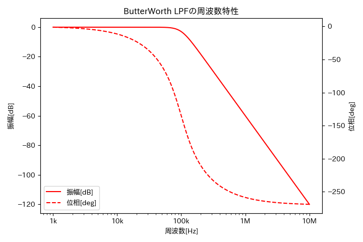
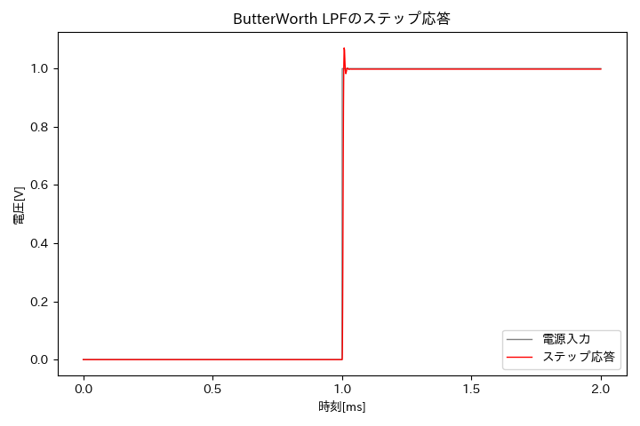
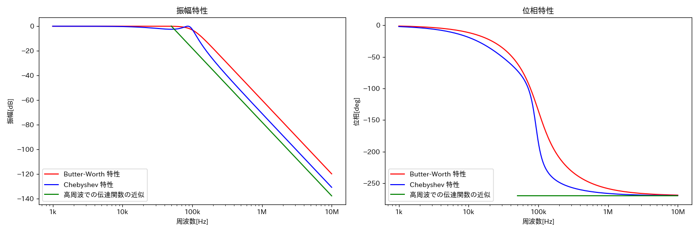

# LTspice exported data plot

## usage

1. LTspiceの `export data` 機能でプロットしたいデータを `.txt` 形式にしてダウンロードする

Formatには `Polar: (dB, deg)` を指定してください。

この時、1つの波形のみが描画されたシミュレーション画面から `.txt` を抽出してください。

2. このリポジトリをcloneしてくる

```
> git clone https://github.com/hamadatakaki/ltspice-plot.git
```

3. セットアップ

`requirements.txt` から依存ライブラリを入れます。

```
> pip3 install -r requirements.txt
```

直接pipで入れずに仮想環境を挟む場合は次のようにするといいです。

```
> python3 -m venv .venv
> source .venv/bin/activate
> pip install -r requirements.txt
```

4. 実行

生成したいグラフに対する `.py` を [examples](#examples) から選んで実行します。

```
> python3 <.py file>
> python <.py file> # 仮想環境を挟む場合こうなるはず
```

# examples

## シンプルな周波数特性図



対応するファイルは `plot_freq_characteristics.py` です。

```shell
> python3 plot_freq_characteristics.py -i <input txt path> -o <image dst path> -c config/ButterWorthLPFFreq.yaml
```

`<imput txt path>` は周波数特性図に変換したい `.txt` のパスを、 `<image dst path>` は周波数特性図の保存先のパス（拡張子はpng）を指定してください。

`-c` オプションの引数はグラフの詳細設定を行う `.yaml` を指定します。
Chebyshevフィルタの場合は `config/ChebyshevLPFFreq.yaml` に替えてください。
僕が用意した設定が気に入らない場合は自分で書き換えてみてください。

```shell
## usage
> python3 plot_freq_characteristics.py -i data/butterworth.txt -o fig/butterworth_freq_char.png -c config/ButterWorthLPFFreq.yaml

# LTspice Reader
text path: data/butterworth.txt
sample size: 401
frequencies range [Hz]: [1000.0, 10000000.0]
amplitude range [dB] [-0.0163213687717722, -120.00101217432]
phase ranges [deg]: [-1.1443753012390516, -268.8528622415462]

# Drawer
figure size: [7.2 4.8]
```

## シンプルなステップ応答



対応するファイルは `plot_step_responses.py` です。

```shell
> python3 plot_step_responses.py -i <input txt path> -s <step txt path> -o <image dst path> -c config/ButterWorthLPFStep.yaml
```

`<imput txt path>` は電源入力の波形を出力した `.txt` のパスを、
`<step txt path>` はステップ応答の波形を出力した `.txt` のパスを、
`<image dst path>` はステップ応答図の保存先のパス（拡張子はpng）を指定してください。

`-c` オプションは周波数特性と同様です。

```shell
## usage
> python3 plot_step_responses.py -i data/input.txt -s data/butterworth_step.txt -o fig/butterworth_times_char.png -c config/ButterWorthLPFStep.yaml

# LTspice Reader
pulse path: data/input.txt
step path: data/butterworth_step.txt
sample size: 92
times range [s]: [0.0, 0.002]
pulse voltage range [V]: [0.0, 1.0]
step voltage range [V]: [0.0, 1.07114]

# Drawer
figure size: [7.2 4.8]
```

## 2つのフィルタで周波数特性の比較



```shell
> python plot_freq_char_compare.py -bw <input butter-worth txt path> -ch <input chebyshev txt path> -o <image dst path> -c config/CompareFreqBWChebyshev.yaml
```

`<input butter-worth txt path>` はButter-Worthフィルタの周波数特性を出力した `.txt` のパスを、
`<input chebyshev txt path>` はChebyshevフィルタの周波数特性を出力した `.txt` のパスを、
`<image dst path>` は周波数特性比較図の保存先のパス（拡張子はpng）を指定してください。

`-c` オプションは周波数特性と同様です。 `config/CompareFreqBWChebyshev.yaml` を選んでください